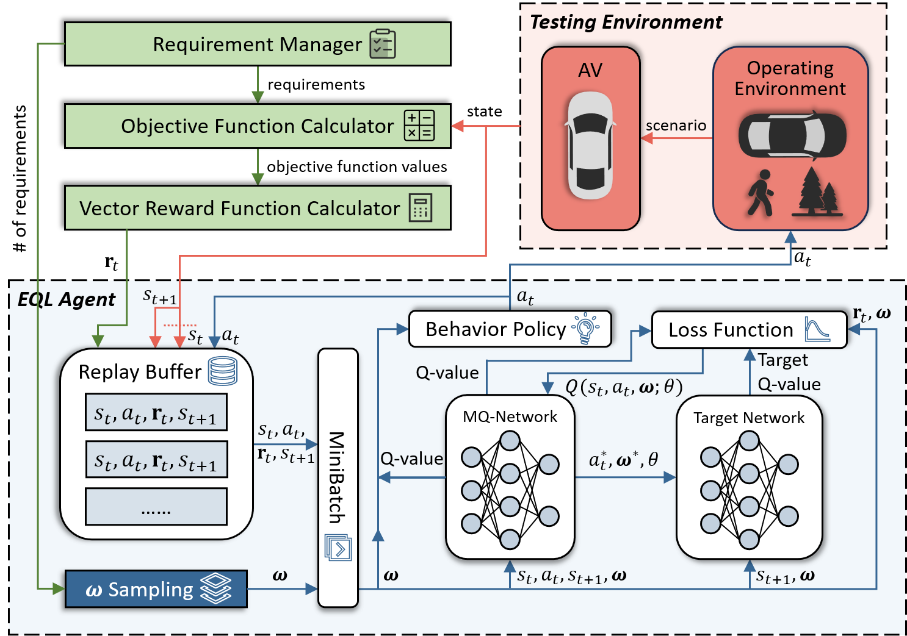

# Reinforcement Learning for Testing Interdependent Requirements in Autonomous Vehicles: An Empirical Study

## Abstract
Autonomous vehicles (AVs) make driving decisions without humans, making dependability assurance a critical concern. Scenario-based testing has been widely used to evaluate AVs under diverse conditions, with reinforcement learning (RL) serving as a key technique for generating test scenarios that identify violations of functional and safety requirements. Many requirements are interdependent and involve trade-offs, making it unclear whether single-objective RL (SORL), which combines objectives into a single reward, can reliably reveal violations or whether multi-objective RL (MORL), which explicitly considers multiple objectives, is necessary. We present an empirical evaluation comparing SORL and MORL for generating critical scenarios that simultaneously test interdependent requirements using an end-to-end AV controller and high-fidelity simulator. Results suggest that MORL and SORL differ mainly in how requirement violations occur, while showing comparable effectiveness in many cases. MORL tends to generate a larger number of requirement-violation scenarios, whereas SORL produces violations of higher severity. Their relative performance also depends on specific objective combinations and, to a lesser extent, road conditions. Regarding diversity, MORL consistently covers a broader range of scenarios. Based on these findings, MORL is more suitable when scenario diversity and coverage are prioritized, whereas SORL may be preferred for generating more severe violations under certain conditions. Our empirical evaluation addresses a gap in the literature by systematically comparing the performance of SORL and MORL across multiple dimensions, highlighting the importance of accounting for requirement dependencies in RL-based AV testing.



## Setup
Operating System: Linux

Python Version: 3.7

```
# build the environment
pip install -r requirements.txt
cd interfuser
python setup.py develop

# download and setup CARLA 0.9.10.1
chmod +x setup_carla.sh
./setup_carla.sh
easy_install carla/PythonAPI/carla/dist/carla-0.9.10-py3.7-linux-x86_64.egg
```
Download the model weights (`interfuser.pth.tar`) from [MORL Drive](https://drive.google.com/drive/folders/1OIIqBWMVGB94rqNjCqA0xnYWRLGt0Bs-?usp=sharing) and place it in the `leaderboard/team_code/` folder.

This part of the configuration is derived from the [InterFuser](https://github.com/opendilab/InterFuser) project. For further details, please refer to the original project.

## How to run
### Training
```
cd RL/MORL_morl

# for MORL
python strategy_morl.py --port=2000 --trafficManagerPort=8000 \
--evaluations=1200 --algorithm=envelope --objective=comfort+speed_diff \
--optuna=False --eval=False --npc_fixed=True --lr=0.0001 --batch_size=16 \
--learning_starts=512 --max_grad_norm=1.0 --num_sample_w=16 \
--decay_steps=4000 --memory=2000 --drop_rate=0.0 \
--npc_json_file=npc_initial_location_scenario_1.json --scenario_id=scenario_1 \
--routes=/MORL/leaderboard/data/test_routes/scenario_1.xml \
--scenarios=/MORL/leaderboard/data/test_routes/scenario_1.json

# for SORL
python strategy_morl.py --port=2000 --trafficManagerPort=8000 \
--evaluations=1200 --algorithm=deepcollision --objective=comfort+speed_diff \
--optuna=False --eval=False --npc_fixed=True --lr=0.001 --decay_steps=1000 \
--batch_size=16 --learning_starts=512 --memory=1000 --drop_rate=0.0 \
--npc_json_file=npc_initial_location_scenario_1.json --scenario_id=scenario_1 \
--routes=/MORL/leaderboard/data/test_routes/scenario_1.xml \
--scenarios=/MORL/leaderboard/data/test_routes/scenario_1.json
```

### Evaluation
```
cd RL/MORL_morl

# for MORL
python strategy_morl.py --port=2000 --trafficManagerPort=8000 \
--evaluations=100 --algorithm=envelope --objective=time_to_collision+speed_diff \
--optuna=False --eval=True --npc_fixed=True --lr=0.0001 --batch_size=16 \
--learning_starts=512 --max_grad_norm=1.0 --num_sample_w=16 --decay_steps=None \
--memory=2000 --drop_rate=0.0 --npc_json_file=npc_initial_location_scenario_1.json \
--scenario_id=scenario_1 --routes=/MORL/leaderboard/data/test_routes/scenario_1.xml \
--scenarios=/MORL/leaderboard/data/test_routes/scenario_1.json

# for SORL
python strategy_morl.py --port=2000 --trafficManagerPort=8000 \
--evaluations=100 --algorithm=deepcollision --objective=time_to_collision+speed_diff \
--optuna=False --eval=True --npc_fixed=True --lr=0.001 --decay_steps=None \
--batch_size=16 --learning_starts=512 --memory=1000 --drop_rate=0.0 \
--npc_json_file=npc_initial_location_scenario_1.json --scenario_id=scenario_1 \
--routes=/MORL/leaderboard/data/test_routes/scenario_1.xml \
--scenarios=/MORL/leaderboard/data/test_routes/scenario_1.json

# for random
python strategy_morl.py --port=2000 --trafficManagerPort=8000 \
--evaluations=100 --algorithm=random \
--objective=distance+time_to_collision+completion+comfort+speed_diff \
--optuna=False --eval=True --npc_fixed=True \
--npc_json_file=npc_initial_location_scenario_5.json --scenario_id=scenario_5 \
--routes=/MORL/leaderboard/data/test_routes/scenario_5.xml \
--scenarios=/MORL/leaderboard/data/test_routes/scenario_5.json
```

### Parameters
- **port**: Port used by the CARLA simulator.
- **trafficManagerPort**: Port used by the CARLA Traffic Manager.
- **evaluations**: Number of evaluations (iterations) for the reinforcement learning algorithm.
- **algorithm**: Name of the algorithm.
- **objective**: Combination of objectives connected by `+`. Available options include `distance`, `time_to_collision`, `completion`, `comfort`, and `speed_diff`.
- **optuna**: Whether to use Optuna for hyperparameter tuning.
- **eval**: Whether to run model evaluation.
- **npc_fixed**: Whether NPC initialization is fixed in the scenario.
- **lr**: Learning rate.
- **batch_size**: Batch size for training.
- **learning_starts**: Number of steps before training starts.
- **max_grad_norm**: Maximum gradient norm for clipping.
- **num_sample_w**: Number of sampled weights (for multi-objective learning).
- **decay_steps**: Number of steps for learning rate decay.
- **memory**: Size of the replay buffer.
- **drop_rate**: Dropout rate.
- **npc_json_file**: JSON file for NPC initialization.
- **scenario_id**: Scenario identifier.
- **routes**: Path to the route file.
- **scenarios**: Path to the scenario configuration file.

### Analysis
```
cd RL/MORL_morl
conda create -n statistic python=3.9
conda activate statistic
pip install -r requirements.txt
python evaluation.py
```

## Models, Data, and Results
**_RL/MORL_morl/train_results_** contains trained models and training process data. The relevant models and data can be downloaded from [MORL Drive](https://drive.google.com/drive/folders/1OIIqBWMVGB94rqNjCqA0xnYWRLGt0Bs-?usp=sharing).

**_RL/MORL_morl/eval_results_** contains evaluation process data and evaluation results. Note that to save storage space, the executable models are not directly provided in this folder. You can manually copy the **.tar** pretrained model files from the **_RL/MORL_morl/train_results_** folder into this directory and adjust the command parameters accordingly before running.
